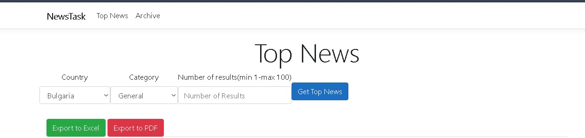
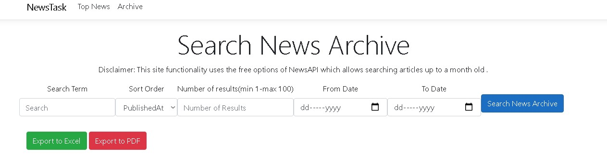

# NewsTask

NewsTask is a website to get Top News from around the world.
It has 2 main functionalities:

  ## Get Top News

Here you can get the top news from different countries from around the world as well from different categories.

Default values are :
- Country: Bulgaria
- Category: General
- Number of articles: 20

## Search News Archive

Here you can search the archive of news by search term and up to a month old.
Also the result can be sorted by 3 categories: PublishedAt , Popularity , Relevance